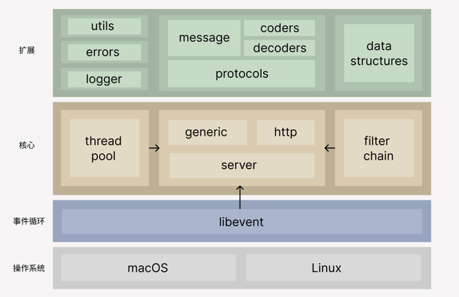

#概述
tcp_kit 是一个轻量级的 TCP 网络开发套件，它可以轻松构建出你想要的网络应用程序。简洁高效是 tcp_kit 的设计宗旨，套件中内置了各种常用的协议，通过简单的组装它们即可完成各种复杂的需求。

此外，tcp_kit 可以与 libevent 很好地配合，这也意味着许多 libevent 提供的组件只需要简单的封装就能在你的项目中使用。

## tcp_kit 的组成


大体上可以将 tcp_kit 分为两部分：核心层和扩展层。核心层几乎包含了所有基础组件，它们都服务于 server 类，也就是我们运行网络程序的入口。扩展层则在核心层的基础上扩展了功能。

### 线程池
tcp_kit 实现了一个动态容量的线程池，tcp_kit 通过该线程池分配所有线程。

### 过滤器
过滤器可以织入 TCP 连接的整个生命周期，通过编写回调函数并注册到 server 中即可，这也是扩展 tcp_kit 的主要方式，你可以在过滤器中实现消息序列化/反序列化、加/解密、校验、路由等功能

### 过滤器链
过滤器链将 server 中注册的所有过滤器组装成一个完整的调用过程，它们按照顺序或嵌套执行（取决于回调函数的类型），过滤器链中的任何错误发生都将导致连接断开。

### 协议簇 (Protocols)
通常一个完整的网络消息处理就是在各种协议之间来回转换，tcp_kit 希望将各种协议放在一个类(Protocols)中统一处理它们。通过一些特定的规则，就能改变 tcp_kit 的运行方式。generic 与 http 类是内置存在的两种实现，通常只需要在这两个类的基础上修改就已经足够了。

### generic 和 http 组件
tcp_kit 中存在两种 Protocols 实现，generic 类和 http 类，前者是更常用的，只需要声明你需要的过滤器列表就可以运行它们。generic 默认使用 Google Protocol Buffers 作为消息解析引擎，如果你不想使用它，将其中的序列化/反序列化过滤器更改为你需要的即可。

对于 http 类也差不多，规则是通用的。那么为什么要将他们分为两个类实现呢？libevent 也为 http 协议提供了支持，但在使用方式上与普通的 tcp 连接不太一样，tcp_kit 为了兼容这种差异，对 http 做了额外的调整。理论上，你可以自己编写用于处理 http 连接的过滤器并在 generic 上声明它们，只是会更麻烦一些而已。

### api
在示例中有这样一段代码，将消息原封不动地回传给客户端：
```c++
svr.api("echo", [](std::string msg){
    return msg;
});
```
实际上消息是被封装在 generic 类内部定义的一组通用消息协议中的。通过内部的消息路由过滤器 (api_dispatcher) 对消息提取，然后传递给我们向 server 注册的 api 处理函数的参数，也就是代码中的 msg 变量。

### server 组件
通过 server 可以启动一个网络服务，它自动分配合适的线程，当然你也可以自定义它。server 类将所有的组件集成，使它们相互配合，并按照特定的方式运行。

到这里你已经对 tcp_kit 有了初步的认识。接下来，我们可以结合一些小案例，学习如何定制它。